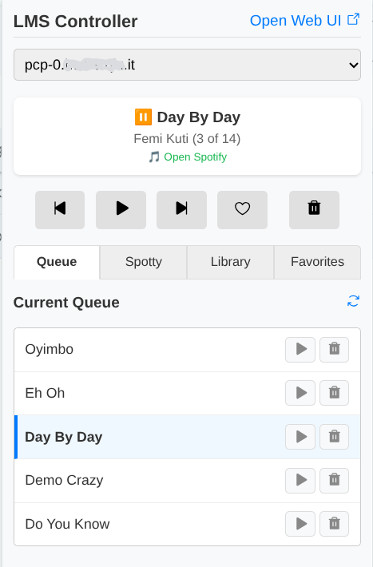
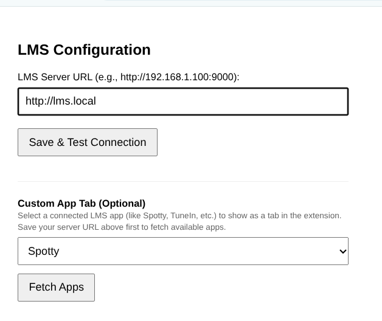

# LMS (Lyrion Media Server) Chrome Extension

A Chrome extension designed to interface seamlessly with a Lyrion Media Server (LMS). It provides quick access to media controls, player selection, and basic library navigation directly from your browser toolbar.

> **Note:** This extension was designed primarily for my own personal use, so I make no guarantees about its stability or ongoing support, but it might just suit your needs! Also, it was completely vibe coded with Gemini. ✨

## Features

- **Player Management:** View connected players and select the active playback device.
- **Transport Controls:** Play, pause, skip forward, skip backward, and view the currently playing track with its album art.
- **Queue & Library Management:** Browse your current queue, library, and favorites. Add items to the queue or play them directly.
- **Custom App Tab:** Configure a custom tab for quick access to a specific LMS app (specifically designed for the Spotty plugin).

## Screenshots

<div align="center">
  
  &nbsp;&nbsp;&nbsp;&nbsp;
  
</div>

## Installation & Configuration

### Loading the Extension

1. Open Google Chrome and navigate to `chrome://extensions/`.
2. Enable **Developer mode** by toggling the switch in the top right corner.
3. Click the **Load unpacked** button.
4. Select the `lms-extension` directory on your local machine.

### Configuration

1. Once the extension is loaded, its icon will appear in your Chrome toolbar.
2. Click the extension icon. If it's your first time, you will be prompted to configure the server.
3. Click **Open Options** (or right-click the extension icon and select **Options**).
4. Enter the full URL to your LMS instance (e.g., `http://192.168.1.100:9000/` or `http://lms.local/`).
5. (Optional) Configure a Custom App Command if you want a dedicated tab for a specific plugin.
6. Click **Save Configuration**. The extension will verify the connection and is ready to use.

## Privacy & Permissions

The extension requests optional host permissions (represented by `http://*/*` and `https://*/*` in the manifest) dynamically when you configure your server URL.

**Why is this needed?**

Lyrion Media Server is self-hosted. Because your server could be located on any local IP address (e.g., `192.168.1.10`), custom local domain (e.g., `http://lms.local`), or remote domain, the extension must be legally allowed to send HTTP JSON-RPC requests to the URL you specify. Instead of asking for broad permissions upfront during installation, the extension securely requests access *only* to your specific server URL when you save it in the Options page.

The extension **does not** track your browsing history or inject scripts into other web pages. It only communicates with the exact server URL you provide in its configuration.

## Development

### Setup

Currently, this extension uses pure vanilla JavaScript and has no build dependencies or `node_modules` required for development.

To build the release zip files, simply run the included bash script:

```bash
bash scripts/build.sh
```

Or if you have `npm` installed, you can still use the wrapper command:
```bash
npm run build
```

## Architecture & Decisions

- **Manifest V3:** Built using the modern Chrome extension standard.
- **No Background Worker:** The extension state is updated only when the popup is open, pulling data directly via HTTP JSON-RPC to conserve resources.
- **Communication:** Uses the LMS JSON-RPC API (`/jsonrpc.js`) via standard `fetch` calls.

## Acknowledgments

- Icons are provided by **[Phosphor Icons](https://phosphoricons.com/)**, which is licensed under the MIT License.
